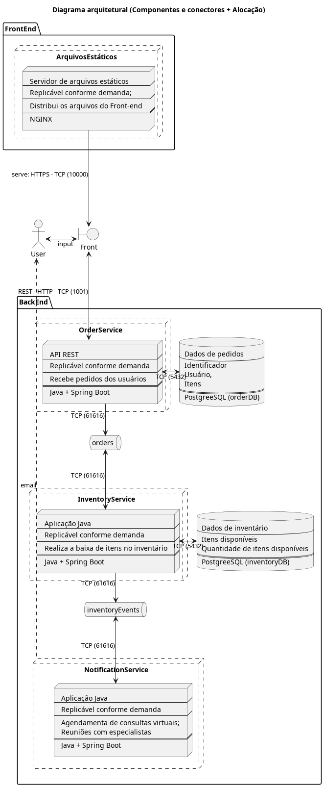

# Projeto Final - Software Concorrente e Distribuído
Aluno: Victor Martins Vieira

### Proposta
Criar uma plataforma de comércio eletrônico composto por três serviços:
- Serviço de pedidos (OrderService)
- Serviço de inventário (InventoryService)
- Serviço de notificação (NotificationService)

### Requisitos
Para a implementação da solução exigida na proposta do trabalho, foram apresentados os seguintes requisitos.

#### Requisitos funcionais
| Identificador | Descrição |
| -- | -- |
| RF-1 | OrderService deve expor uma API REST (POST /orders) que gera um UUID, timestamp e lista de itens |
| RF-2 | InventoryService deve processar as mensagens geradas e publica sucesso ou falha |
| RF-3 | NotificationService registra as notificações enviadas no console |

#### Requisitos não-funcionais
| Identificador | Tipo | Descrição |
| -- | -- | -- |
| RNF-1 | Requisito de implementação | A linguagem de programação definida para o projeto é Java |
| RNF-2 | Requisito de padrões | A solução deve ser implementada utilizando uma arquitetura de microsserviços |
| RNF-3 | Requisito de padrões | A solução deve empregar o padrão de mensageria |
| RNF-4 | Requisito de implementação | Devem ser utilizados Apache Kafka ou Apache ActiveMQ como broker |
| RNF-5 | Requisito de eficiência | A aplicação deve ser escalável |
| RNF-6 | Requisito de confiabilidade | A aplicação deve ser tolerante à falha de um dos seus componentes |
| RNF-7 | Requisito de entrega | O projeto deve possuir documentação conforme arquivo  |

### Arquitetura
Para a implementação do projeto, conforme solicitado nas instruções, foi utilizada uma arquitetura de microsserviços, dividida em:
- Serviço de pedidos (OrderService) - Recebe os pedidos via API REST e publica informações na fila de pedidos;
- Serviço de inventário (InventoryService) - Busca os pedidos na fila, verifica se é possível atender o pedido, altera as informações no estoque se possível, e publica uma notificação na fila dos eventos de inventário;
- Serviço de notificação (NotificationService) - Busca as notificações na fila e exibe para o usuário.

#### Tecnologias utilizadas
Para implementar o trabalho, foram utilizadas as seguintes tecnologias:
- Java 17;
- Maven;
- Spring + Spring Boot;
- PostgreSQL;
- ActiveMQ; e
- Docker + Docker-Compose.

#### Diagramas
##### Diagrama Entidade-Relacionamento (DER)


##### Diagrama de Sequência


##### Diagrama de Componentes e Conectores


### Respostas às questões propostas no documento de orientação
1. Como você poderia conseguir escalabilidade com o broker utilizado
> Da forma como foi proposto, o sistema possui três serviços (OrderService, InventoryService e NotificationService) que podem ser escalados conforme a demanda por esses serviços aumenta; da mesma forma, instâncias desses serviços podem ser destruídas quando não se fizerem mais necessárias, a fim de poupar recursos.  
> Para se alcançar essa escalabilidade, além das funcionalidades decompostas em serviços e disponibilizadas em containers, seria necessário a utilização de uma solução de balanceamento de carga e de orquestração de containers, para que seja possível replicar as instâncias, conforme necessário e distribuir as requisições entre os containers que expõem APIs REST.  
> Na arquitetura proposta, o ActiveMQ (broker escolhido) tem o papel de possibilitar a comunicação entre os serviços, de forma que mesmo que haja várias instâncias, elas podem interagir criando e consumindo dados em uma fila sem interferir no trabalho umas das outras e sem duplicar trabalho.

2. O que significa tolerancia à falhas? Explique uma situação de falha que poderia ocorrer e como o Broker poderia tratá-la.
> Tolerância a falhas diz respeito à capacidade de um serviço se manter funcional, seja em plena capacidade ou capacidade reduzida, apesar de uma falha ocorrida em um dos seus componentes.  
> Por exemplo, caso uma instância de um dos containers de serviço da aplicação encontre uma falha da qual não é capaz de se recuperar e precise ser reiniciado, os dados com os quais estava operando ficam disponíveis como uma mensagem no broker, para que uma outra instância recupere os dados e finalize a execução da tarefa, dando continuídade ao fluxo da operação.

3. Explique o conceito de idempotência e como fazer para garantí-lo.
> Idempotência diz respeito à consistência das respostas dadas por um software, ou seja, dada uma mesma entrada, o software deve ser capaz de produzir a mesma saída.  
> Durante o design de um sistema de software, várias medidas são empregadas a fim de garantir a sua idempotência, a exemplo de: design de interações com o banco de dados (utilização de transações atômicas), design da API (escolha de métodos HTTP adequados), uso de IDs unívocos (identificadores únicos para cada operação), controle de concorrência e conflitos, tratamento de erros.


### Instruções de execução
Para promover a facilidade de uso, a aplicação foi containerizada utilizando o Docker e os containers foram orquestrados utilizando Docker-Compose.  

Caso necessite de ajuda para instalar o [Docker](https://docs.docker.com/engine/install/) ou o [Docker Compose](https://docs.docker.com/compose/install/), clique no nome da ferramenta para ver a documentação.  

Para executar a aplicação, primeiro é necessário compilar as três imagens relativas aos serviços que compõem a aplicação:
- orderService,
- inventoryService, e
- notificationService.

Para isso, abra um terminal na pasta raiz do repositório e utilize o seguinte comando:
```bash
docker compose build
```

Após compilar as imagens necessárias, você pode executá-la utilizando o comando:
```bash
docker compose up
```

Caso utilize o comando acima, os containers permanecerão ativos enquanto o terminal estiver aberto e executando o comando, e será mostrado o log de execução de todos os containers, sendo possível visualizar a troca de mensagens (para fins didáticos, além de enviar a mensagem para o broker, ela também é impressa nos logs).  
Caso esse comportamento não seja desejado, utilize o comando abaixo:
```bash
docker compose up -d
```

Nesse caso, os containers são executados em segundo plano, e você pode optar por visualizar o log de cada container separadamente, utilizando o comando:
```bash
docker compose logs --follow [orderService | inventoryService | notificationService ]
```

Uma vez que o FrontEnd do sistema não foi concluído, foi disponibilizado uma coleção do Postman para interagir com a API de pedidos. ([Link para instruções](https://learning.postman.com/docs/getting-started/importing-and-exporting/importing-data/)) (arquivo Projeto final - Software Concorrente e Distribuído.postman_collection.json) 


Caso tenha utilizado o comando para executar os containers em segundo plano, utilize o comando a seguir para encerrar a execução:
```bash
docker compose down
```

E o comando abaixo para remover os containers que não estão mais sendo executados:
```bash
docker compose rm
```

#### Portas disponibilizadas
Durante a execução dos containers, as seguintes portas estão disponíveis para inspeção/interação:
| Porta | Serviço | Descrição |
| --- | --- | --- |
| 9990 | inventoryDB | Porta para conexão com o banco de dados de inventário |
| 9991 | orderDB | Porta para conexão com o banco de dados de pedidos |
| 9992 | activeMQ | Porta para conexão com a interface administrativa do ActiveMQ |
| 10000 | orderService | Porta realizar requisições HTTP à API orderService |
